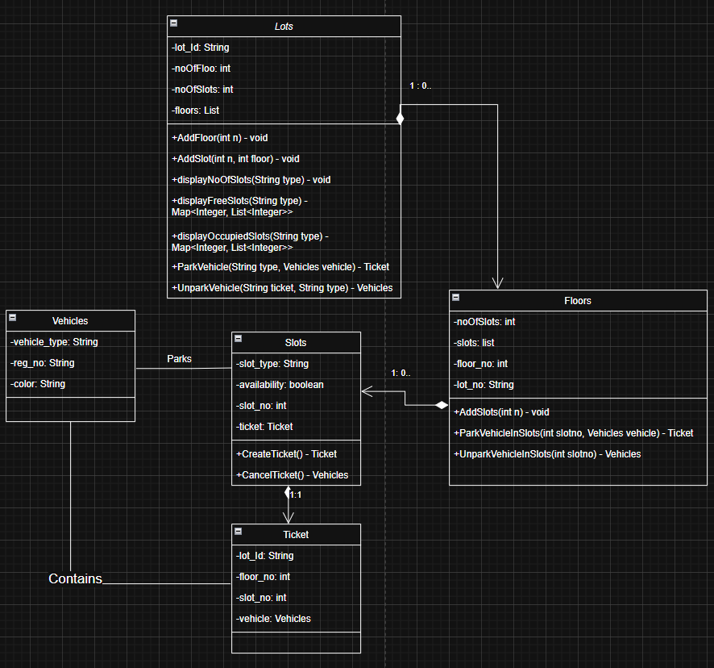

# 🚗 Parking Lot System - Low Level Design (LLD)

## 📌 Problem Statement

A **parking lot** is an area where vehicles can be parked for a certain amount of time. In this system, the parking lot can have **multiple floors**, with each floor having different **types of slots** suitable for various **vehicle types**.

We aim to design a **next-generation parking lot system** that can be operated **completely autonomously**—no human intervention required.

---

## ✅ Features

This is a command-line application that provides the following functionalities:

- ✅ Create a parking lot.
- ✅ Add floors to the parking lot.
- ✅ Add parking slots to any floor.
- ✅ Given a vehicle, find the **first available slot**, **book it**, **create a ticket**, **park the vehicle**, and return the **ticket ID**.
- ✅ Unpark a vehicle using a ticket ID.
- ✅ Display the **number of free slots per floor** for a specific vehicle type.
- ✅ Display **all free slots per floor** for a specific vehicle type.
- ✅ Display **all occupied slots per floor** for a specific vehicle type.

---

## 🚘 Vehicle Details

Each vehicle will have the following properties:

- Vehicle type (Car, Bike, Truck)
- Registration number
- Color

---

## 🅿️ Parking Slot Details

Each parking slot:

- Supports **only one specific type of vehicle**.
- Cannot be used by a different vehicle type.
- The system will find the **first available slot** based on:
  - Matching slot type with vehicle type
  - **Lowest floor number** first
  - **Lowest slot number** on that floor

Slot numbering:

- Serially from `1 to n` for each floor.

---

## 🏢 Parking Lot Floors

- Numbered serially from `1 to n` (where `n` is total number of floors).
- Floor slot configuration:
  - Slot 1 → Truck
  - Slots 2 & 3 → Bikes
  - All remaining → Cars

---

## 🎫 Ticket Details

- Each ticket has a unique ID in the format:

<parking_lot_id><floor_no><slot_no>

- Example:

PR1234_2_5 // 5th slot of 2nd floor in parking lot PR1234

- Note: We assume a single parking lot in the system, and its ID is **PR1234**.

---

## 📊 Class Diagram

> A visual representation of the system's classes and their relationships.

---